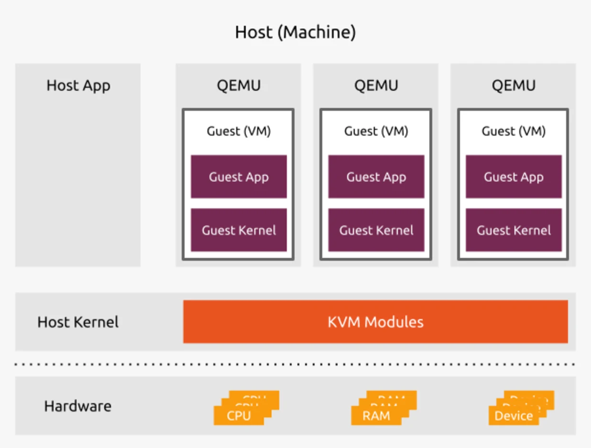

Introduction to Virtualization

Imagine you have **four physical servers**: a web server, mail server, database server, and lastly an application server. Let's assume each server is operating at only *35%* capacity. While these servers get the job done, each is sitting idle most of the time, and we can all agree this is a wastage of precious resources. This is where virtualization comes in!

With virtualization, it is possible to combine all the tasks onto fewer machines, and optimize resource usage for better efficiency. The aim with Virtualization is to maximize a physical machine’s hardware capacity by sharing its capabilities among many users or environments. In a nutshell, virtualization enables multiple operating systems to run on a single physical machine(computer hardware).

In most modern Linux distributions, virtualization is supported out-of-the-box. This allows a single Linux machine to host multiple virtual machines (VMs), with each VM running separate operating system (Linux, Windows, Unix, etc.) as if they were separate computers. These VMs are useful for safely testing software applications without the danger of breaking the entire host system.

### Advantages of Virtualization

When you adopt Virtualization, you will gain the following benefits  over physical machines

#### Isolation and Security

-  Virtual Machines run on a virtualized kernel which is separate from the host OS.

- This isolation ensures security breaches or crashes within a VM don't affect the host system.

#### Flexible Resource Allocation

- You have the privilege of customizing the resources allocated to each VM - *CPU*, *memory*,  and *storage* to maximize hardware utilization.

- Since resource allocation is done at the software level, there is precise control over hardware resources.

#### Cost Efficiency

- With Virtualization you running multiple VMs on a single physical machine, reducing hardware requirements and the associated costs.

#### Software Compatibility

- VMs can run different operating systems from the host computer.

- This allows you to use applications designed for specific OSes, even if incompatible with your host system.

#### Software-Controlled Configurations

- All the configurations of the Virtual Machines are saved as data on the host.
- This means the Virtual Machine can be easily created, cloned, removed, migrated, and managed remotely.

### Key terminologies

It is important to understand the core terms commonly used in the world of Virtualization.

#### Hypervisor

- The core of virtualization technology

- It is a software layer that controls hardware resources

- The hypervisor is responsible for the creation and management of virtual machines (VMs) on the physical host machine.

- It handles the allocation of resources (cpu, memory, storage, and network) to the Virtual Machines and ensures they are running efficiency and securely.

- There are two main types of hypervisors - Type 1 (bare-metal) and Type 2 (hosted).

#### Virtual Machine (VM)

- A software emulated computer system running on a physical machine (host).

- It has virtual hardware resources (cpu, memory, storage, and network interface). Each VM runs its own operating system (guest OS).

- The applications deployed on the VM run independently of the host machine.

#### Guest OS

- An operating system installed and running on a virtual machine (VM).

- It can be any operating system and it runs independent of the host's OS

#### Host OS

- An operating system installed on the physical computer hardware.

- It handles the management of the physical hardware resources and hosts the hypervisor software.

- Multiple VMs can run on the host OS and it plays an important role in the stability and performance of the virtualized environment.

#### A Virtualization Platform

- This is a term that acts as an umbrella for complete system

- It consist of the hypervisor, libraries, and management tools used to create and manage the virtual machines.

## Introduction to Kernel-based Virtual Machine (KVM)

Kernel-based Virtual Machine (KVM) is an open source and free virtualization technology built directly into the Linux kernel. It enables you to convert your underlying physical machine into a hypervisor so that you can host multiple, isolated virtual machines (VMs). It is a perfect open source alternative to commercial hypervisors like VMware or XenServer.

Each Virtual Machine has its own virtualized hardware like Storage, Memory, CPU, network interface, and virtual BIOS (basic input/output system) making each VM to operate independent of other VMs.

Here are the components and and terminology used in KVM:

**Kernel Modules**

- ***kvm.ko***: This is the core module in KVM and it allows for the communication with the underlying hardware and enables guest execution.

- ***kvm-intel.ko or kvm-amd.ko*:** These are processor-specific modules. They provide CPU hardware virtualization extensions. `kvm-intel.ko`is pecific to Intel VT and `kvm-amd.ko` for AMD-V architectures.

**User-space Utilities**

- **QEMU (Quick Emulator):** This is a free and open source, user-space machine emulator. It can emulate virtual hardware devices like disks, network cards, USB devices, graphics cards, integrated systems on a chip (SoCs), or display devices such as standard VGA for the VMs. QEMU provides a complete virtual environment where guest operating systems can run.

- **Libvirt:** It is a collection of libraries that make it easy to manage Virtual Machines. It provides a unified API for managing multiple virtualization hypervisors such as KVM, QEMU, Xen and LXC. It allows for the creation, management, and the overall control of VMs using tools like `virsh`, `virt-manager`, etc. Libvirt is composed of *libvirt API (C API)*, *libvirtd* (daemon), and *virsh* (command-line utility).

**Guest Environment**

- **Guest OS:** Operating system that has been installed on the Virtual Machine provisioned in KVM. This can be Windows, Linux, or any OS compatible with the KVM architecture.
- **Virtual Hardware:** The guest OS interacts with virtualized hardware resources like CPU, memory, storage, and networking provided by KVM.

### Key Features KVM

The following are some key features of KVM virtualization solution.

#### Cost Effectiveness

- KVM is a free and open-source solution eliminating licensing costs often associated with proprietary virtualization software solutions available in the market such as VMware.

- Being an open source solution, the end user has the ability to do deep customizations and any third party integrations with other open-source tools, making KVM adaptable to specific customer needs.

#### Security

- KVM is secure by design as it incorporates robust security measures provided by the Linux kernel

- It uses Security-Enhanced Linux (SELinux) / AppArmor to enforce strict access though Mandatory Access Control (MAC) and prevent unauthorized access

- secure virtualization (sVirt) also enhances the isolation and the security for virtual machines

#### Management Tools

- A number of KVM management tools are available, such as Libvirt, virsh, virt-manager, and Cockpit.

- With these tools it becomes easy to perform comprehensive management of the VMs, including VM creation, storage and network configurations, and monitoring.

#### Storage Management

- KVM can use any storage provided Linux supports it, this include local disks, , network-attached storage (NAS), and storage area networks (SANs), and object storage solutions such as Ceph.

#### Performance & Scalability

- With KVM you enjoy the performance features of the Linux kernel. The hardware virtualization extensions (Intel VT or AMD-V) significantly improves the guest VM performance.

- The Linux kernel does well in the efficient resource allocation to the VMs (CPU, memory, storage). This leads to high performance than other virtualization platforms.

- KVM is capable of handling a large number of virtual machines within a single physical machine. With this you can maximize hardware utilization and prevent resource undertutilization.

#### Hardware Support and Flexibility

- **Wide Support for Hardware**: KVM has a wide support for server hardware vendor solutions. It works with a vast range of x86 processors with hardware virtualization extensions, offering broad compatibility.

- **Live Migration**: With KVM you can migrate running virtual machines between physical hosts without encountering downtime. This enables you to perform maintenance on a host and better workload balancing.

- **Snapshot Feature**: In KVM it is possible to take VM snapshots of its state. This allows you to revert to a previous working state if any runtime issues are encoutered and as a disaster recovery strategy.

#### Maturity

- KVM has been under active development since its first introduction in the Linux kernel in 2007

- The long-standing development history of KVM is an indications of its high level of maturity and stability.

- It also benefits for from a large and diverse community of contributors, including developers from major technology companies. This ensures there is ongoing enhancements to KVM and bug fixes within time.

### Virtual Machine XML configuration

In KVM, the virtual machine configurations are kept in a host-based XML configuration file (also known as domain XML file). This configuration file contain the settings for the virtual machine and define the devices attached.

XML configuration file includes:

- Virtual machine metadata information such as the instance name, and other information about the VM.

- All the devices atatched to the VM. This include memory, virtual CPUs (vCPUS), storage devices, network interface cards, input/output devices, and any other hardware.

- Specific vitual machine settings like the maximum amount of memory it can use, and other VM settings.
